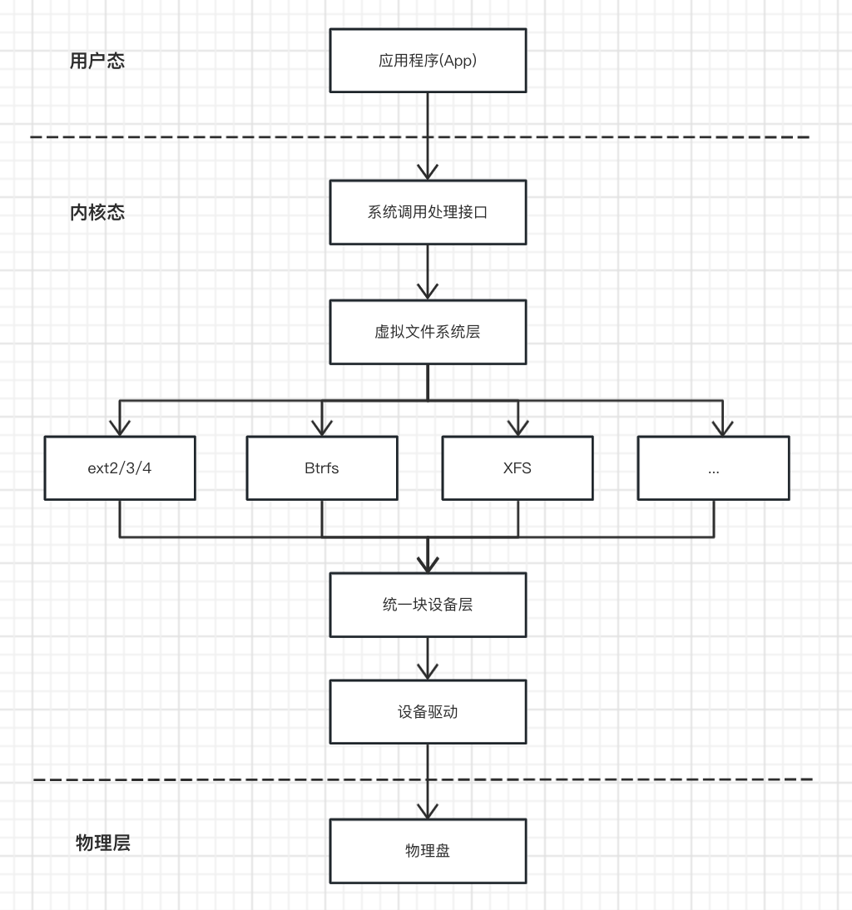
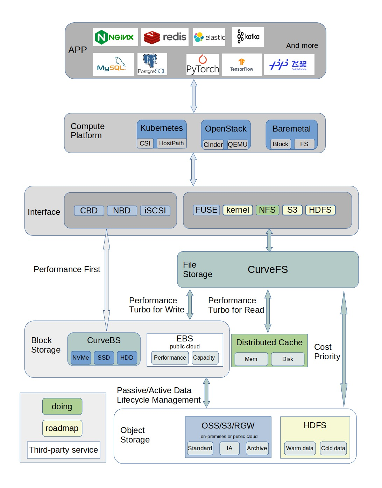
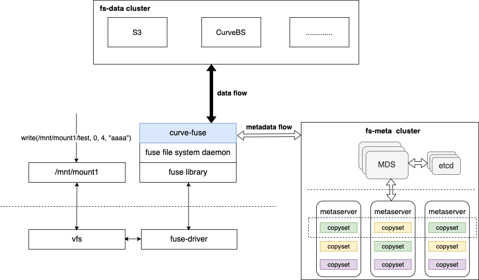

# turtle
#### IO存储栈

- 系统调用
- 虚拟文件系统VFS
- 文件系统
- 块设备
- 设备驱动

#### 网络存储
- Ceph
- Minio
- JuiceFS

#### CSI
- CSI接口
- TopoLVM

#### curve架构

#### curvefs架构

CurveFS由三个部分组成：
1. `curve-fuse` 是基于 fuse 的文件系统客户端。
   - 接收并处理 fuse 的请求，与fs-meta cluster 交互实现对元数据的增删改查，与 fs-data cluster 交互实现对数据的增删改查；
   - 提供元数据缓存和数据缓存以提高性能；
   - 用户可以通过客户端访问不同的文件系统实例。
2. `fs-meta cluster` 是 CurveFS 的元数据服务集群。
   - 它的架构类似 CurveBS，由 MDS 和 Metaserver 两个部分组成，高可扩、高可用；
   - mds 用于管理集群拓扑、集群调度、文件系统实例、文件元数据分片管理；基于 etcd 存储集群拓扑、用户和文件系统信息；基于 etcd 实现 mds 的高可用。
   - metaserver 用于存储文件的元数据( inode 和 dentry )，通过 multi-raft 实现高可用和高可靠。每个 raft 复制组管理多组元数据分片。
3. `fs-data cluster` 是 CurveFS 的数据服务集群。
   - 当前支持S3标准接口的对象存储以及 CurveBS；
   - 用户可以根据性能场景灵活配置；
   - 也因为支持多种存储集群，CurveFS 的元数据使用独立的集群统一管理。
